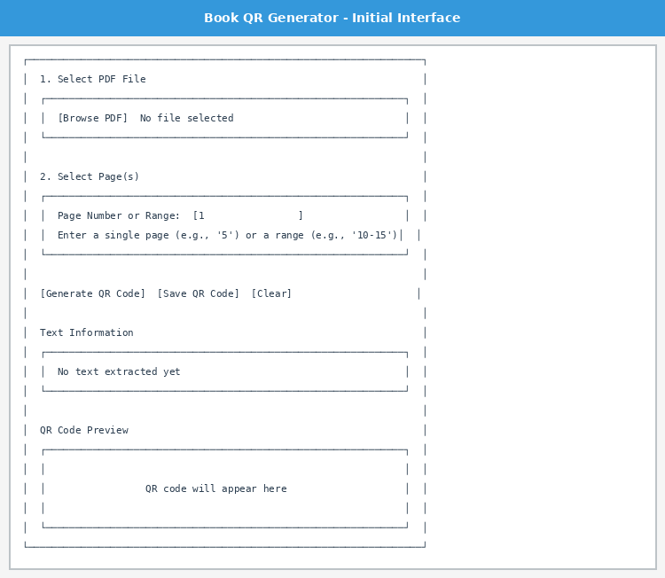
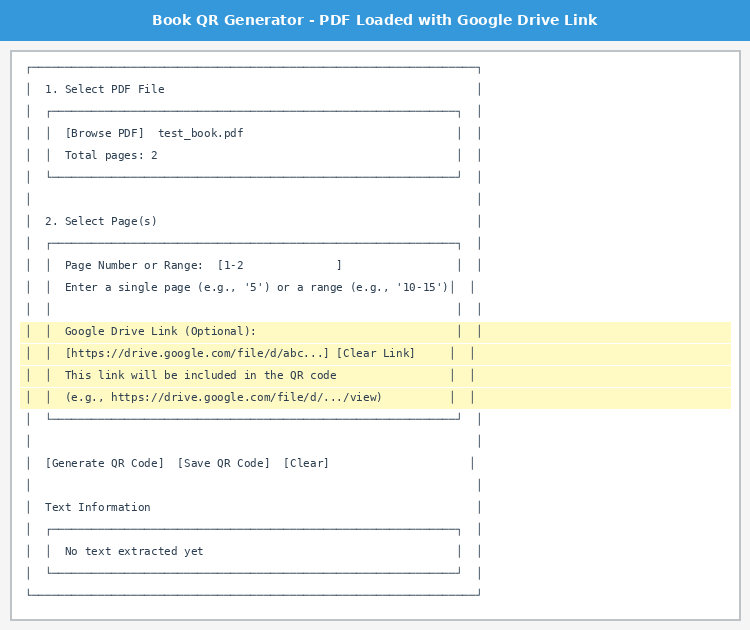
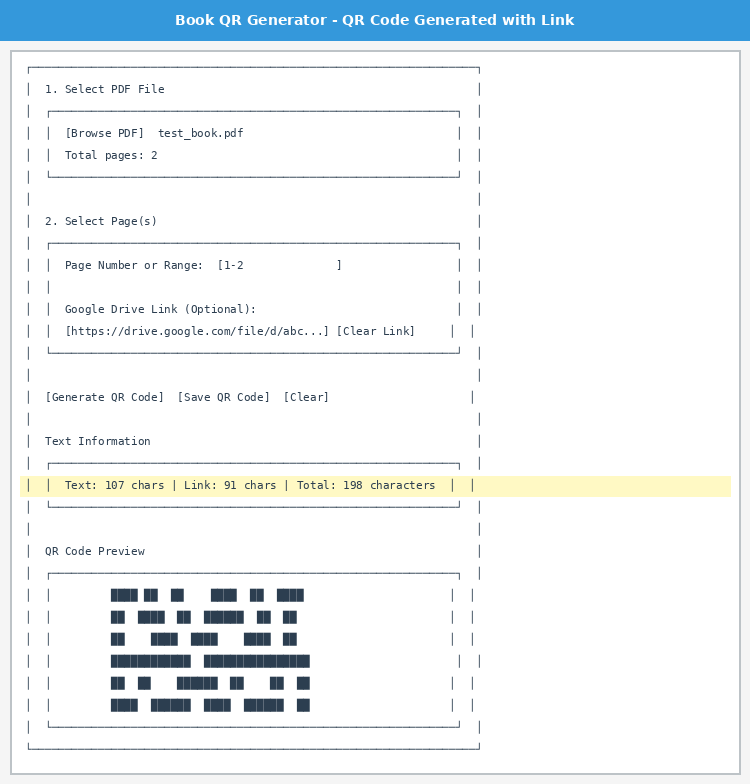
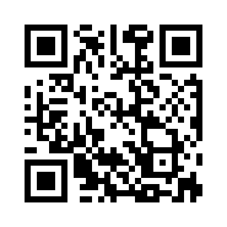
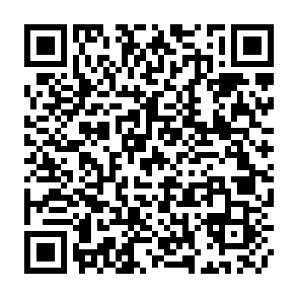
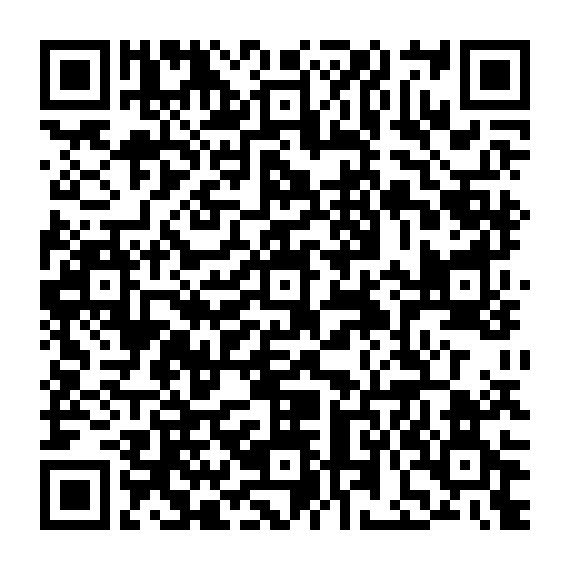

# Book QR Generator

A lightweight desktop application with dual modes for generating QR codes: extract text from PDF pages OR quickly convert any URL/text into a scannable QR code.

## Features

### Dual Mode Interface
The application now features a **tabbed interface** with two powerful modes:

#### 📄 PDF to QR Code Mode
- **PDF Upload**: Browse and select PDF files from your local system
- **Page/Chapter Selection**: Specify single pages or page ranges (e.g., "5" or "10-15")
- **Text Extraction**: Extract text content from specified pages of the PDF
- **Google Drive Link Integration**: Optionally include a Google Drive link in the QR code
- **QR Code Generation**: Generate QR codes containing the extracted text and optional link

#### 🌐 URL to QR Code Mode
- **Quick URL Conversion**: Instantly convert any URL into a QR code
- **Text Support**: Works with any text, not just URLs (emails, phone numbers, plain text)
- **Auto-formatting**: Automatically adds "https://" to URLs that need it
- **Character Counter**: Real-time character count as you type
- **High Error Correction**: Uses high error correction level for reliable scanning
- **Instant Generation**: No waiting - QR codes generate immediately

### General Features
- 💾 **Save & Preview**: Display generated QR codes in the app and save them as PNG images
- ✅ **Cross-Platform**: Works on Windows, macOS, and Linux
- 🛡️ **Error Handling**: Comprehensive validation and user-friendly error messages
- 🎨 **Clean UI**: Easy-to-use tabbed interface for quick mode switching

## Installation

### Prerequisites

- Python 3.x (Python 3.7 or higher recommended)
- pip (Python package installer)

### Setup Instructions

1. **Clone the repository** (or download the source code):
   ```bash
   git clone https://github.com/marcusg999/book-qr-generator.git
   cd book-qr-generator
   ```

2. **Install required dependencies**:
   ```bash
   pip install -r requirements.txt
   ```

   This will install:
   - `pypdf` (version 3.0.0+) - For PDF text extraction
   - `qrcode[pil]` (version 7.4.2+) - For QR code generation
   - `Pillow` (version 10.0.0+) - For image handling

## Screenshots

### Tabbed Interface
The application features a clean tabbed interface for easy switching between PDF and URL modes.

### PDF to QR Code Mode


*The PDF mode showing the PDF file selector and page range input.*



*Application with a PDF loaded and an optional Google Drive link entered.*



*Generated QR code preview with character count breakdown showing both text and link lengths.*

### URL to QR Code Mode


*Sample QR code generated from a URL - quick and simple!*


*Sample QR code generated from plain text.*


*Sample QR code generated from an email address.*

### Sample QR Code from PDF Mode


*Sample QR code containing text from pages 1-2 of a test PDF along with a Google Drive link. This QR code can be scanned with any QR code reader app.*

## Usage

### Running the Application

Run the application using Python:

```bash
python app.py
```

### How to Use

The application has two modes accessible via tabs at the top:

#### PDF to QR Code Mode

1. **Select a PDF File**:
   - Click the "Browse PDF" button
   - Navigate to and select your PDF file
   - The application will display the total number of pages

2. **Specify Page(s)**:
   - For a single page: Enter the page number (e.g., `5`)
   - For a page range: Enter the range with a hyphen (e.g., `10-15`)
   - The default is page 1

3. **Add Google Drive Link (Optional)**:
   - Paste a Google Drive link in the "Google Drive Link (Optional)" field
   - Supported formats include:
     - `https://drive.google.com/file/d/[file_id]/view`
     - `https://drive.google.com/open?id=[file_id]`
     - `https://docs.google.com/document/d/[doc_id]/`
   - Click "Clear Link" to remove the link if needed
   - The app will validate if it's a Google link and warn you if not

4. **Generate QR Code**:
   - Click the "Generate QR Code" button
   - The application will extract text from the specified page(s)
   - If a Google Drive link is provided, it will be appended to the QR code content
   - A QR code will be generated and displayed in the preview area
   - Character count breakdown will be shown (text, link, and total)

5. **Save QR Code**:
   - Click the "Save QR Code" button
   - Choose a location and filename
   - The QR code will be saved as a PNG image

6. **Clear Form**:
   - Click the "Clear" button to reset the application and start over

#### URL to QR Code Mode

1. **Enter URL or Text**:
   - Click on the text input field
   - Type or paste any URL (e.g., `https://google.com` or just `google.com`)
   - Or enter any text you want to encode (email, phone number, plain text)
   - The character count updates automatically as you type

2. **Generate QR Code**:
   - Click the "Generate QR Code" button
   - The QR code appears instantly in the preview area
   - URLs without protocol (http/https) are automatically formatted

3. **Save QR Code**:
   - Click the "Save QR Code" button
   - Choose a location and filename (default: `qrcode_url.png`)
   - The QR code will be saved as a PNG image

4. **Clear**:
   - Click the "Clear" button to reset the input and start over

### Use Cases

**PDF Mode** is perfect for:
- Creating QR codes for book chapters or sections
- Sharing PDF content with QR codes in presentations
- Embedding text content from documents into scannable codes
- Linking to cloud storage along with document content

**URL Mode** is perfect for:
- Quick URL-to-QR conversion for websites
- Event invitations with URL links
- Business cards with contact information
- WiFi passwords or network credentials
- Email addresses and phone numbers
- Any text that needs to be quickly scanned

## Technical Details

### QR Code Settings

#### PDF Mode
- **Error Correction**: Low (to maximize data capacity for large text)
- **Auto-sizing**: QR version adjusts automatically based on content
- **Size**: 256x256 pixels (adjustable)
- **Warning threshold**: 2,000 characters

#### URL Mode
- **Error Correction**: High (for better scanning reliability)
- **Auto-sizing**: QR version adjusts automatically based on content
- **Size**: 256x256 pixels (adjustable)
- **Warning threshold**: 2,000 characters
- **Colors**: Black on white for maximum contrast

### QR Code Size Limitations

QR codes have data capacity limitations based on several factors:

- **Maximum capacity**: Approximately 4,296 alphanumeric characters (theoretical maximum)
- **Recommended limit**: ~2,000 characters for reliable scanning
- **Warning threshold**: The application warns when content exceeds 2,000 characters
- **Large text**: QR codes with large amounts of text become very dense and may be difficult to scan

**Tips for best results**:
- Use smaller page ranges for chapters with dense text
- Consider the Google Drive link length when selecting page ranges
- Test QR codes with a mobile scanner app after generation
- If a QR code is too dense, try splitting it into smaller ranges or omitting the link

### Google Drive Link Format

When a Google Drive link is included, the QR code content is formatted as follows:

```
[Extracted Text Content]

---
Google Drive Link: [your link]
```

The link validation accepts various Google Drive and Google Docs formats:
- Google Drive files: `https://drive.google.com/file/d/...`
- Google Drive folders: `https://drive.google.com/drive/folders/...`
- Google Docs: `https://docs.google.com/document/d/...`
- Google Sheets: `https://sheets.google.com/spreadsheets/d/...`
- Google Slides: `https://slides.google.com/presentation/d/...`

The application will warn you if the URL doesn't appear to be a Google link, but will still allow generation if you choose to proceed.

### Error Handling

The application handles various error scenarios:

**PDF Mode:**
- **Invalid PDF**: Validates that the selected file is a valid PDF
- **Page out of range**: Checks that specified pages exist in the PDF
- **Invalid page format**: Validates page number and range formats
- **Empty pages**: Alerts if no text can be extracted from selected pages
- **Text too large**: Warns when text may be too large for reliable QR scanning

**URL Mode:**
- **Empty input**: Warns if no content is entered
- **URL formatting**: Automatically adds https:// to URLs when needed
- **Text too large**: Warns when content exceeds 2,000 characters
- **Save errors**: Handles file permission and path issues gracefully

### Text Processing

- Text from multiple pages in a range is concatenated with spacing
- Excessive whitespace is cleaned up for better QR code efficiency
- Original text formatting from PDF is preserved where possible

## Dependencies

The application requires the following Python packages:

```
pypdf>=3.0.0          # PDF text extraction
qrcode[pil]>=7.4.2    # QR code generation with image support
Pillow>=10.0.0        # Image handling and processing
```

All dependencies are cross-platform and work on Windows, macOS, and Linux.

## GUI Framework

The application uses **Tkinter**, which is included with most Python installations and requires no additional setup. This makes the application truly lightweight with minimal external dependencies.

## Troubleshooting

### Common Issues

**Issue**: "No module named 'tkinter'" error
- **Solution**: Install Tkinter for your Python version:
  - Ubuntu/Debian: `sudo apt-get install python3-tk`
  - Fedora: `sudo dnf install python3-tkinter`
  - macOS: Tkinter is included with Python from python.org
  - Windows: Tkinter is included with standard Python installation

**Issue**: QR code won't scan on mobile device
- **Solution**: The content might be too large. Try:
  - Using a smaller page range (PDF mode)
  - Shortening the URL or text (URL mode)
  - Ensure good lighting when scanning
  - Try a different QR code scanner app

**Issue**: URL not recognized properly
- **Solution**: 
  - The app automatically adds https:// to URLs
  - For other protocols, include them explicitly (e.g., ftp://)
  - Plain text (non-URLs) work fine too

**Issue**: "Failed to load PDF" error
- **Solution**: 
  - Verify the file is a valid PDF
  - Check if the PDF is password-protected (not supported)
  - Try opening the PDF in a PDF reader to confirm it's not corrupted

**Issue**: No text extracted from page
- **Solution**: 
  - The page might contain only images or scanned content
  - PDFs with text as images require OCR (not included in this app)
  - Try different pages that contain selectable text

## Testing

To verify the application works correctly:

### PDF Mode Tests
1. ✅ Test with a single page selection
2. ✅ Test with a page range selection
3. ✅ Test with invalid page numbers (should show error)
4. ✅ Test with page ranges exceeding total pages (should show error)
5. ✅ Test with empty/image-only pages (should show warning)
6. ✅ Test with large text content (should show warning)
7. ✅ Test QR code generation without Google Drive link (text only)
8. ✅ Test QR code generation with valid Google Drive link
9. ✅ Test QR code generation with non-Google URL (should warn but allow)
10. ✅ Test "Clear Link" button functionality
11. ✅ Test character count display with and without link
12. ✅ Scan generated QR codes with a mobile device to verify content
13. ✅ Test save functionality in different directories
14. ✅ Test "Clear" button to reset all fields

### URL Mode Tests
1. ✅ Test with simple URL (e.g., `https://google.com`)
2. ✅ Test with URL without protocol (e.g., `google.com` - should auto-add https://)
3. ✅ Test with long URL with parameters
4. ✅ Test with plain text (e.g., "Hello World")
5. ✅ Test with email address (e.g., `email@example.com`)
6. ✅ Test with phone number
7. ✅ Test with empty input (should show error)
8. ✅ Test with very long text (>2000 chars, should warn but allow)
9. ✅ Test character counter updates in real-time
10. ✅ Test "Clear" button functionality
11. ✅ Test save functionality with custom filename
12. ✅ Scan generated QR codes with mobile device to verify they work

## License

This project is provided as-is for educational and personal use.

## Contributing

Contributions are welcome! Feel free to submit issues or pull requests.

## Author

Created as a lightweight, cross-platform solution for generating QR codes from PDF content.